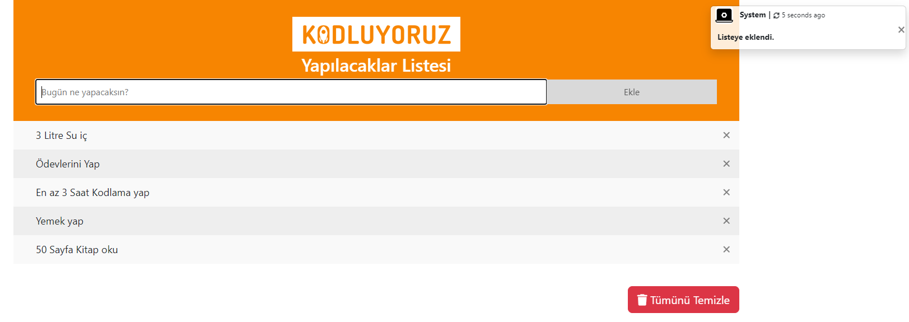

# Javascript Odev - 2 || Javascript ile To Do List



## **Web**


# **Installation**

Öncelikle projeyi clonelayın.
```
git clone https://github.com/Recepurkun/javascript-projects.git
```

# **Usage**
Projeyi cloneladıktan sonra Visual Studio Code programında açınız.

Linux için:
```
cd javascript-projects
code .
```
