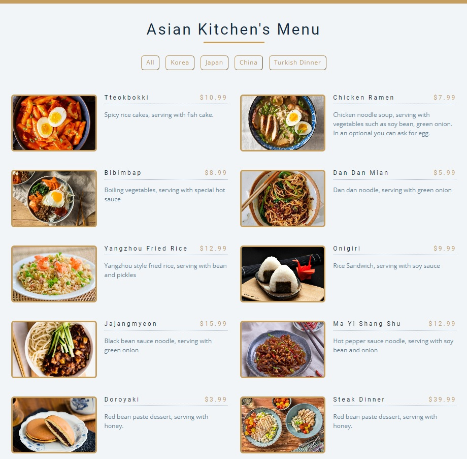

# Javascript Odev - 3 || Asian Kitchen's Menu



# **Installation**

Öncelikle projeyi clonelayın.
```
git clone https://github.com/Recepurkun/javascript_projects/tree/master/odev-3
```

# **Usage**
Projeyi cloneladıktan sonra Visual Studio Code programında açınız.

Linux için:
```
cd javascript-projects
code .
```
